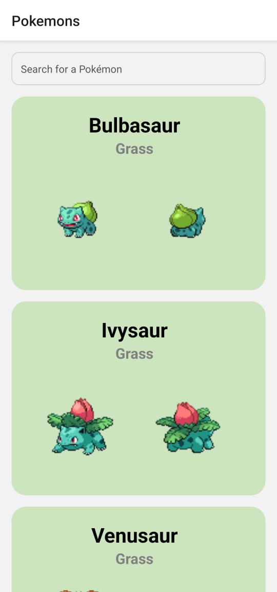
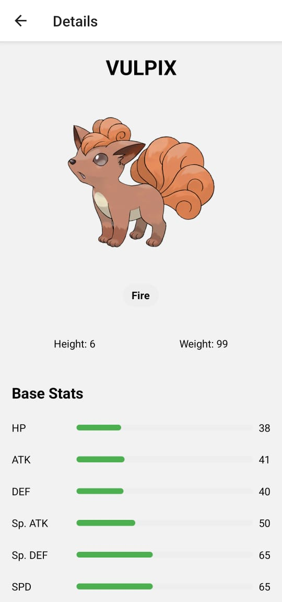

# Poki Intel (Android APK)

**Poki Intel** is a modern **React Native Android application** that allows users to explore Pokémon data in a clean, fast, and intuitive interface. The app fetches real-time data from the official **PokéAPI** and provides detailed statistics for each Pokémon, making it a lightweight yet powerful Pokémon information tool.

Designed with performance, scalability, and readability in mind, Poki Intel demonstrates strong fundamentals in mobile development, API integration, and TypeScript-based architecture.

---

## ✨ Features

* 📜 Browse a complete **Pokémon list**
* 🔎 **Search Pokémon** by name
* 📊 View detailed Pokémon **stats**, including:

  * Health (HP)
  * Attack
  * Defense
  * Speed
  * Special Attack
  * Special Defense
* 🧩 Clean and reusable component-based UI
* 📱 Optimized **Android APK** experience

---

## 🛠️ Tech Stack

* **Framework:** React Native
* **Language:** TypeScript
* **Styling:** Tailwind CSS (NativeWind)
* **API:** PokéAPI ([https://pokeapi.co/](https://pokeapi.co/))

---

## 📸 Screenshots

### App Screens

| Pokémon List                  | Search                            | Pokémon Details                     |
| ----------------------------- | --------------------------------- | ----------------------------------- |
|  |  |  |


<!-- ### Option 1: GitHub-hosted Video


```md
[▶ Watch Poki Intel Demo](videos/poki-intel-demo.mp4)
```

--- -->

## 🚀 Getting Started

### Prerequisites

* Node.js
* npm or yarn
* Android Studio / Android Emulator
* React Native CLI

---

### Installation

```bash
# Clone the repository
git clone https://github.com/Vinit-Jaat/Pokeintel.git

# Navigate into the project
cd PokemonApp

# Install dependencies
npm install
```

---

### Run on Android

```bash
npm expo start
```

---

## 🧩 API Reference

This app uses the **PokéAPI**, a free and open RESTful API providing Pokémon data.

* Pokémon List Endpoint
* Individual Pokémon Stats Endpoint

Official API documentation:
[https://pokeapi.co/docs/v2](https://pokeapi.co/docs/v2)

---

## 📌 Future Enhancements

* ❤️ Favorite Pokémon support
* 📈 Stat comparison between Pokémon
* 🌙 Dark mode
* 📶 Offline caching

---

## 🙏 Acknowledgements

* **PokéAPI** for providing open Pokémon data
* Pokémon is © Nintendo, Game Freak, and Creatures Inc.

---

## 👨‍💻 Author

**Your Name**
GitHub: [@Vinit](https://github.com/Vinit-Jaat)

---

⭐ If you find this project useful or interesting, feel free to give it a star!
